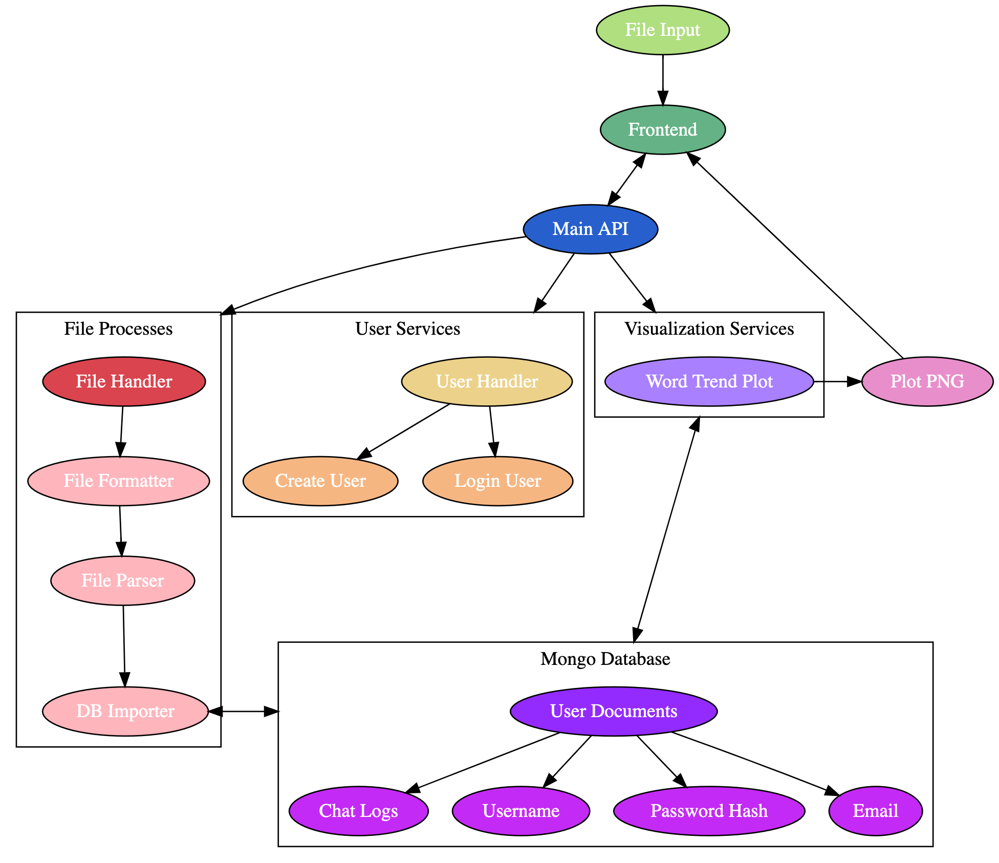

# Data Visualizer
Web-based tool that can process, parse, and query a chat log file from a WhatsApp groupchat.

[Now in open beta.](http://felipearce.pw)

## Project Structure
Log parser built with Go, API built with Python 3 using Flask, data stored on local MongoDB instance.

### Friendgroup data visualizer

#### Goals:
1. parse all the data into numpy arrays that are STANDARD!!
2. store the data in a redis db
3. make an api that displays very compact and understanable data
